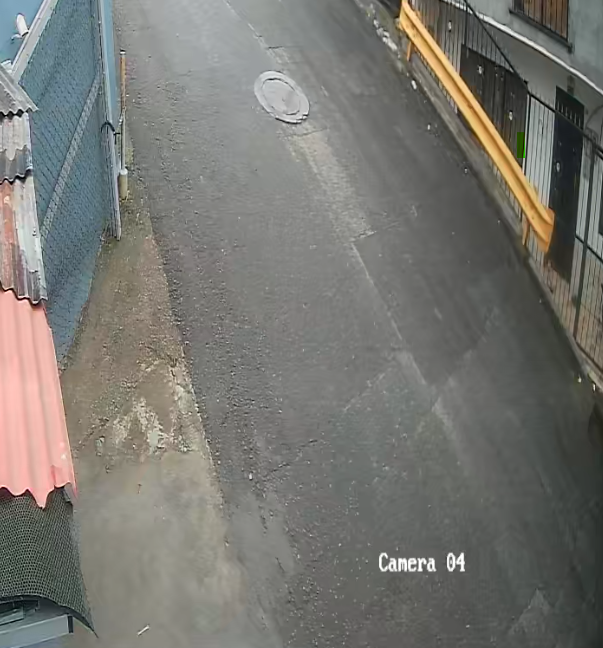
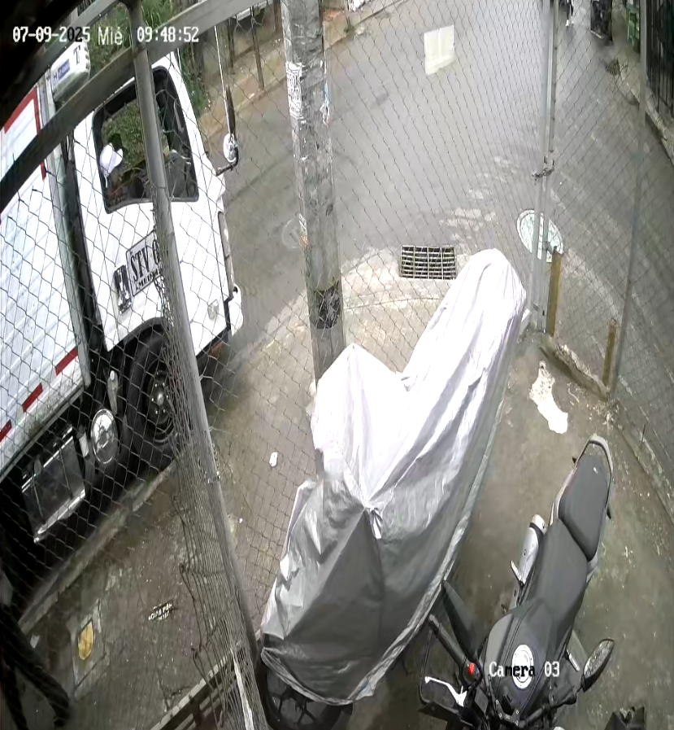
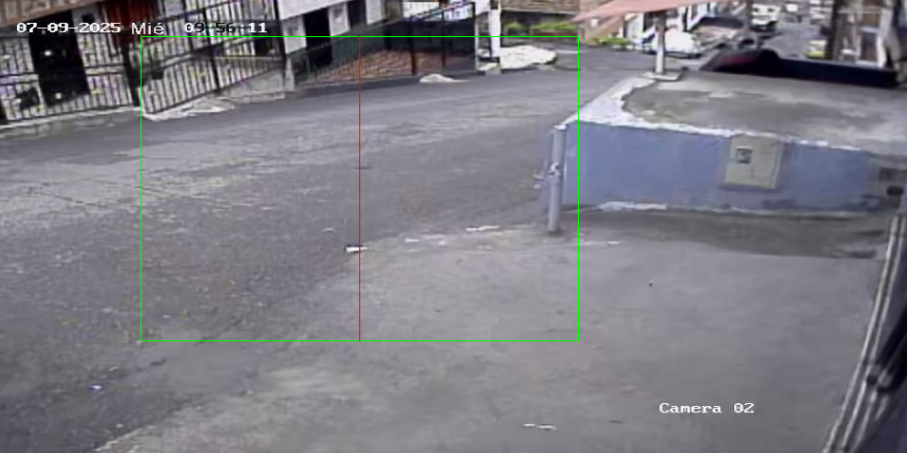

🚆 Infrastructure and Trackside Object Detection using YOLOv8
The exercise located in Exercises/Trains presents an advanced computer vision system based on YOLOv8, designed for the detection and analysis of critical elements surrounding railway tracks and roadways.

🎯 Objective
Automatically detect, classify, and locate relevant objects such as vegetation, traffic signs, utility poles, and litter. The system raises alerts when any of these objects are detected within predefined exclusion zones or critical areas. This functionality enables:

Preventive maintenance (e.g., pruning, debris removal)

Infrastructure verification (e.g., presence of signs and poles)

Automated reporting of anomalies for decision support

🧠 Detected Classes
🌿 Overgrown vegetation

🚯 Litter or solid waste

⚠️ Traffic signage

🪵 Utility or support poles

🚨 Zone-Based Warning Logic
A dynamic exclusion zone is defined in each frame. If any object is detected within this region, a warning is triggered, and the incident can be recorded.

🗺️ Detected incidents can be linked to spatial coordinates or relative positions for reporting, analysis, or dispatching of operational response teams (e.g., for cleanup, pruning, or repairs).

🧪 Technical Highlights
- YOLOv8 custom training with annotated datasets

- Dynamic warning area definition per frame

- Automated logging of detections within critical zones

- Optional integration with backend systems for alerts or storage

📁 Resources and Results
The implementation scripts and additional processing tools can be found in the Exercises/Trains directory.
Some of the output results, including processed images and logs, are available in Results/Trains.

📹 The initial video used for detection can be accessed via [Train data](https://drive.google.com/drive/folders/1i5TJLNIc1vxJCL3xFUoFQQioZUAogb6o?usp=sharing).

  

---

🌴 Computer Vision for Oil Palm Fruit Maturity Classification
The exercise located in Exercises/Palmfruit implements an automated visual inspection system for African oil palm fruit (Elaeis guineensis), using real-time object detection powered by YOLOv8.

🎯 Objective
Automate quality control on an industrial conveyor line by classifying fruits based on ripeness and visible defects in real time.

🔍 Target Classes
The model was trained to identify the following categories:

🟢 Unripe fruit

🟠 Ripe fruit

🔴 Overripe fruit

⚫ Rotten fruit

🧵 Fruit with elongated stalk (peduncle)

🧪 Technical Details
📹 Frames extracted from real industrial video footage

🧾 Manual annotation using tools like Roboflow

🤖 Training with YOLOv8 in YOLOv5-compatible format

📦 Folder contains trained models, inference scripts, and labeled datasets

📁 Resources and Results
The input data, code, and training materials are located in Exercises/Palmfruit.

Output results such as labeled images, metrics, and detection logs can be found in Results/Palmfruit.

📹 Additional video results are available via [Palmfruit](https://drive.google.com/drive/folders/1ibUiWzk1SwQK2xqSKKLFOKZAeI_te0nx?usp=drive_link).

---

🧪 Computer Vision Exercises
Within the Exercises/ directory, three practical exercises are implemented to address real-world computer vision challenges. Each problem is documented in Soluciones.pdf and includes its own subfolder with code and data (results are stored in the /Results/ directory).

🔷 Exercise 1: Gas Leak Detection and Volume Estimation
A system for detecting invisible gas leaks using Optical Gas Imaging (OGI).
The objective is to detect the gas and quantify the volume leaked (e.g., propane) based on differences in infrared imagery.

📁 Results located in: Results/Punto_1
🧠 Techniques: image differencing, segmentation, pixel-wise volume estimation.

🔷 Exercise 2: Cream Detection in Sandwich Cookies
A visual quality control system for sandwich cookies.
The algorithm detects whether the cookies contain adequate cream filling and classifies them as “Bueno” or “Incorrecto”.

📁 Results located in: Results/Punto_2
🧠 Techniques: grayscale analysis, thresholding, contour detection, area filtering.

Galleta buena

Galleta mala

🔷 Exercise 3: Vehicle Speed and License Plate Recognition
A traffic camera captures a vehicle during an infraction.
The task involves estimating the vehicle’s speed and extracting the license plate despite motion blur.

📁 Results located in: Results/Punto_3
🧠 Techniques: motion blur analysis, OCR (Optical Character Recognition), plate localization, speed estimation via frame analysis.

📄 Full documentation, algorithms, and explanation of each approach can be found in Exercises/Soluciones.pdf.

🎥 Visual Example

🌿 NDVI Change Detection in Venice (2017–2025)

This exercise analyzes the Normalized Difference Vegetation Index (NDVI) variation in the Venice region between 2017 and 2025, based on remote sensing data from the Sentinel-2 satellite.

The main objective is to detect vegetation change patterns over time, which can support environmental monitoring, land-use studies, or urban expansion analysis.

🛰️ Data & Implementation
📥 Satellite source: Sentinel-2 (Copernicus Open Access Hub)

📁 Algorithms and processing scripts: Exercises/NDVI-Venice-remote-sensing-2017-2025

🖼️ Processed NDVI maps and difference visualizations: Results/NDVI

Diferencia NDVI

---

📹 Real-Time Object Detection from DVR (Netgear RTSP)
This exercise, located in Exercises/Netgear, demonstrates how to stream video in real time from a Netgear DVR using the RTSP protocol and apply object detection using YOLOv8 from Ultralytics.

The goal is to create a lightweight real-time monitoring system capable of detecting:

🚶‍♂️ People

🚗 Cars

🏍️ Motorcycles

🧠 Main Features
📡 Real-time RTSP video stream capture via OpenCV

🧠 YOLOv8-based inference for common object classes

🗂️ Organized structure for video capture, detection, and output logging

📸 Screenshots or logs saved when detections occur (optional)

⚙️ Detection zones or event-based triggering can be added

📁 Resources
💻 Implementation scripts: Exercises/Netgear

🖼️ Detection result images and logs: Results/Netgear

---

🔢 Real-Time Object Counting via RTSP Stream
This exercise, located in Exercises/Count_objects, implements a real-time object counting system using YOLO (Ultralytics) on live video streams accessed via RTSP.

It allows users to define counting zones by drawing virtual lines or regions of interest (ROIs), and tracks objects (e.g., people or vehicles) crossing those lines.

🎯 Objective
Detect and count objects crossing a defined line or area

Monitor traffic or pedestrian flow using live DVR streams

🧠 Features
🎥 RTSP stream input from DVR or IP camera

🧠 YOLOv8 object detection with customizable class filtering

📏 Counting logic based on object movement across a defined line

📝 Real-time display with total counts, optionally saved to logs

🔄 Works for both bidirectional and unidirectional flow

📁 Resources
🧪 Scripts and configuration: Exercises/Count_objects

📸 Example output frames and logs: Results/Count_objects

1

2

3

